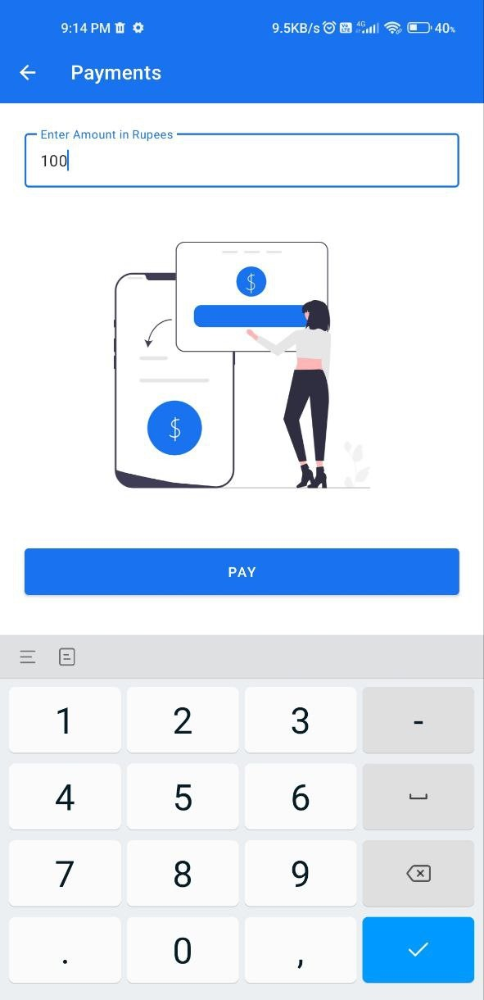
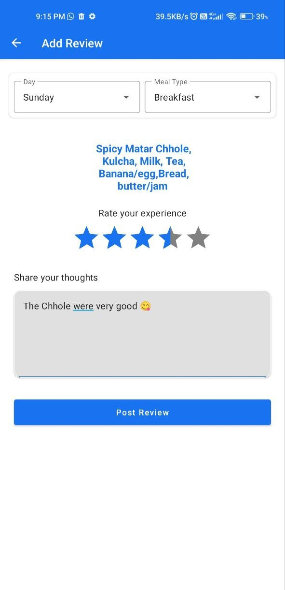
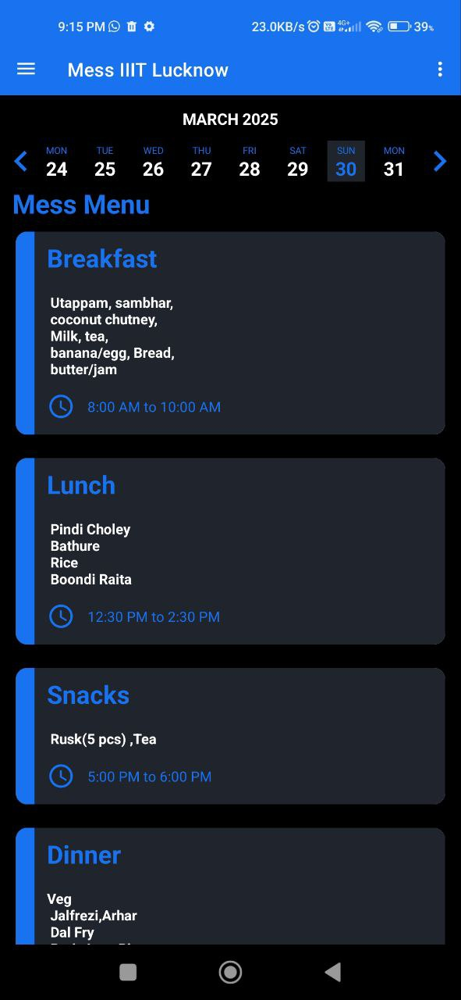

# **MessEase**
## **Contributing**
For contribution guidelines, see [Contributors.md](https://github.com/iiitl/MessEase/blob/master/Contributors.md).

MessEase is an Android application designed to streamline and simplify mess-related operations at the Indian Institute of Information Technology, Lucknow. The app reduces administrative burdens, making daily tasks more efficient for the mess committee.

---

## **Features**

### **1. Daily Menu Display**
View the menu for each day, ensuring all users stay informed about meal options.  

### **2. Automated Push Notifications**
Receive notifications 30 minutes before each meal.

### **3. Mess Committee Section**
A secure section exclusively for mess committee members to manage operations.

### **4. Admin Panel**
An admin-only section to manage users, menus, and other administrative tasks.

### **5. Menu Management**
Committee members can update the menu and notify the admin.  

### **6. Polls and Announcements**
Create polls, send announcements, and share images within the app.  
  

### **7. Flexible Announcement Timings**
Adjust announcement timings as needed.  

### **8. Payment Integration**
Seamlessly make payments to the mess through the app.  

### **9. Downloadable Menu**
Download the current menu, which updates automatically.  

### **10. Admin Management of Members**
The admin can add or remove committee members, with the member list displayed in a dedicated section.

### **11. Review System**
Users can leave reviews about the mess services, helping improve the quality of meals.  

### **12. Dark Mode**
The app supports a dark mode for better user experience.  

---

## **Tech Stack**

- **MVVM Architecture**
- **Firebase Authentication (Email & Google)**
- **Firebase Realtime Database**
- **Firebase Firestore**
- **RecyclerView**
- **Navigation Drawer**
- **Navigation Component**
- **Razorpay Integration**
- **Push Notifications (Google Cloud FCM)**
- **Alarm Manager**
- **Glide**
- **OKHttp**
- **Material Design Library**
- **Lottie Animations**
- **Room Database**

---

## **Demo Video**
[Watch Demo](https://github.com/user-attachments/assets/02c9048d-0d8a-4c44-aea7-d3542ae30826)

---

## **Future Scope**
MessEase is designed with scalability in mind. While currently tailored for IIIT Lucknow, it can be adapted for use by other institutions as well.

---

## **Repository Link**
[MessEase GitHub Repository](https://github.com/Rohan-droid7341/MessEase.git)
